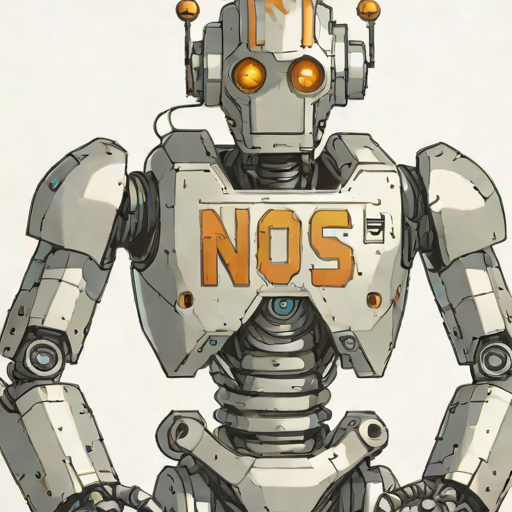
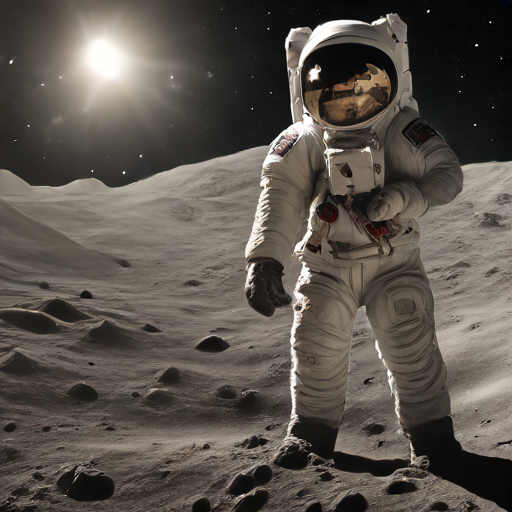
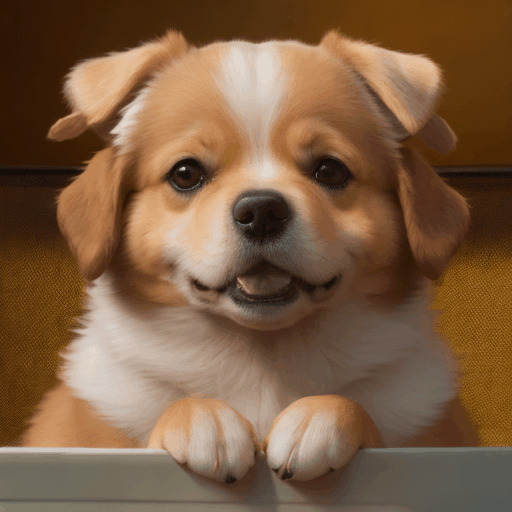
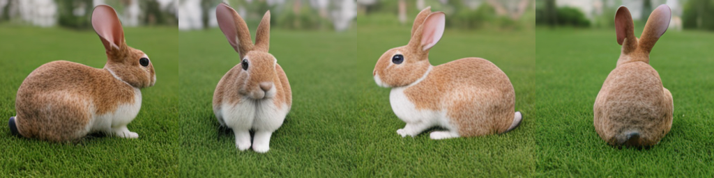

# NOS Playground 🛝
This is a playground for various examples using [NOS](https://github.com/autonomi-ai/nos).



## Installation
Before proceeding, ensure that the NOS server package and all its dependencies have been installed. If you haven't set up the development environment yet, refer to the [quick start document](https://docs.nos.run/docs/quickstart.html) from the [NOS docs](https://docs.nos.run/).

## Quick Start
To serve the model you wish to deploy, execute the following commands:
```console
cd examples/MODEL_ID
nos serve up -c serve.yaml
```
You can then use the NOS Python client library to run the inference:
```python
from PIL import Image
from nos.client import Client

client = Client("[::]:50051")

model_id = "YOUR-MODEL-ID"
models: List[str] = client.ListModels()
assert model_id in models
# Check if the selected model has been served.

inputs = YOUR-MODEL-INPUT
response = model(inputs) # Get output as response.
#change to model.DEFAULT_METHOD_NAME if the default method is defined as  "__call__"
```

## Available Examples

### Chat Completion
```python
model_id: str = "meta-llama/Llama-2-7b-chat-hf"
```

### Video Transcription
```python
model_id: str = "m-bain/whisperx-large-v2"
```

### Text to Image
```python
model_id: List[str] = ["sd-xl-turbo",
                        "playground-v2",
                        "latent-consistency-model"]
```


### Text to Video
```python
model_id: str = "animate-diff"
```


### Image to Video
```python
model_id: str = "stable-video-diffusion"
```


### Text to 360-View Images
```python
model_id: str = "mv-dream"
```


### Image to Mesh Model
```python
model_id: str = "dream-gaussian"
```


### Text to Speech
```python
model_id: str = "bark"
```
### Text to Music
```python
model_id: str = "music-gen"
```

## Reach US
* 💬 For assistance, send us an email at [support@autonomi.ai](mailto:support@autonomi.ai) or join our [Discord](https://discord.gg/QAGgvTuvgg).
* 📣 Stay updated on our products by following us on [Twitter](https://twitter.com/autonomi\_ai) and [LinkedIn](https://www.linkedin.com/company/autonomi-ai).
